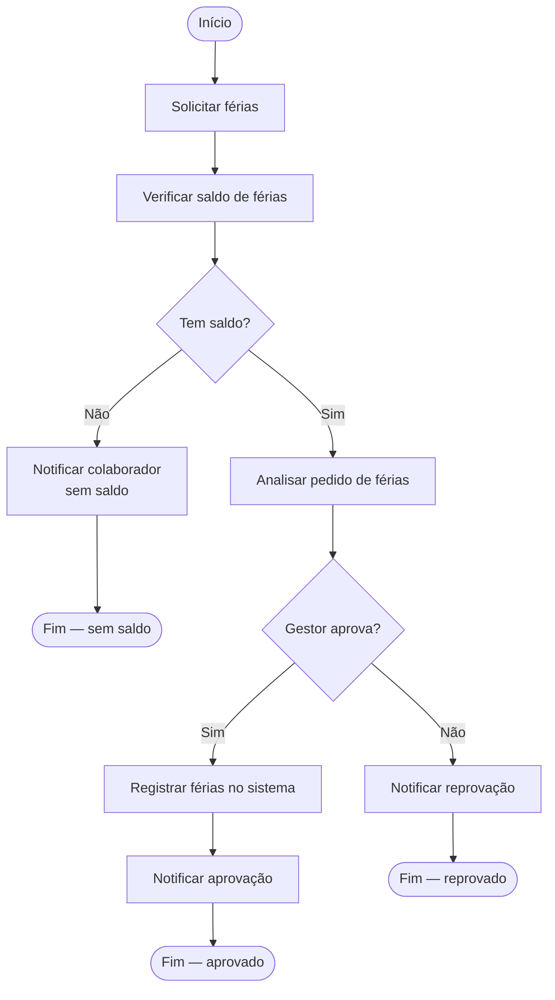
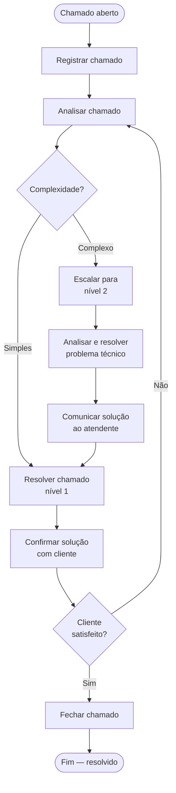

# BPMN 2.0 — Roteiro de Mapas de Processo (Nível Básico)

Guia prático para criar mapas de processo usando o padrão BPMN 2.0 (*Business Process Model and Notation*).

---

## O que é BPMN?

BPMN é um padrão internacional (ISO 19510) para representar processos de negócio de forma visual e padronizada. O objetivo é criar uma linguagem comum que tanto pessoas técnicas quanto não-técnicas consigam entender.

**Por que usar BPMN?**
- Elimina ambiguidade: todos entendem o diagrama da mesma forma
- Facilita comunicação entre áreas (TI, negócio, operações)
- Serve como documentação de processos
- Base para automação e sistemas de workflow (BPM, RPA)

---

## Os 5 elementos fundamentais

Todo processo BPMN é construído com estes elementos:

| Elemento | Representa | Forma visual |
|---|---|---|
| **Evento** | Algo que acontece (início, fim, espera) | Círculo |
| **Atividade** | Algo que é feito (tarefa, trabalho) | Retângulo com cantos arredondados |
| **Gateway** | Decisão ou divisão do fluxo | Losango |
| **Fluxo de sequência** | Ordem de execução | Seta sólida → |
| **Pool / Raia** | Participante ou setor responsável | Retângulo com divisórias |

---

## 1. Eventos

Eventos representam **algo que acontece** durante o processo. São sempre círculos.

### Tipos de evento por posição

| Tipo | Forma | Quando usar |
|---|---|---|
| **Evento de início** | Círculo com borda fina | Dispara o início do processo |
| **Evento intermediário** | Círculo com borda dupla | Ocorre no meio do processo |
| **Evento de fim** | Círculo com borda grossa | Encerra o processo |

### Tipos de evento por gatilho (ícone dentro do círculo)

| Ícone | Nome | Significado |
|---|---|---|
| Vazio (sem ícone) | Nenhum | Início/fim simples, sem causa específica |
| Envelope | Mensagem | Recebeu ou enviou uma mensagem/e-mail |
| Relógio | Timer | Espera um tempo ou data específica |
| Raio | Erro | Ocorreu um erro ou exceção |
| Círculo menor | Sinal | Recebeu um sinal de outro processo |

### Exemplos práticos de eventos

```
Início simples:        ○ —→  (círculo vazio, borda fina)
Início por mensagem:   ◉ —→  (envelope dentro, borda fina)
Início por timer:      ⏰ —→  (relógio dentro, borda fina)

Fim simples:           —→ ⬤  (círculo preenchido, borda grossa)
Fim com erro:          —→ ✕  (X dentro, borda grossa)
```

**Regras:**
- Todo processo precisa de **pelo menos um evento de início** e **um evento de fim**
- Um processo pode ter múltiplos eventos de início (ex: receber pedido OU receber ligação)
- Um processo pode ter múltiplos eventos de fim (ex: aprovado OU reprovado)

---

## 2. Atividades (Tarefas)

Atividades representam **trabalho que é realizado**. São retângulos com cantos arredondados.

### Tipos de tarefa

| Tipo | Ícone | Quando usar |
|---|---|---|
| **Tarefa de usuário** | Pessoa | Executada por um humano (ex: preencher formulário) |
| **Tarefa de serviço** | Engrenagem | Executada por sistema automaticamente |
| **Tarefa de envio** | Envelope sólido | Envia mensagem para outro participante |
| **Tarefa de recebimento** | Envelope vazio | Aguarda receber mensagem |
| **Tarefa manual** | Mão | Feita manualmente, sem sistema |
| **Tarefa de script** | Papel com linhas | Executa um script ou código |

### Nomenclatura de tarefas

Sempre use o padrão: **Verbo + Objeto**

```
✅ Correto:
- Analisar solicitação
- Enviar proposta
- Aprovar pedido
- Registrar pagamento
- Notificar cliente

❌ Incorreto:
- Análise (substantivo sem verbo)
- O sistema verifica se o usuário está cadastrado (texto longo demais)
- Fazer coisas (vago)
```

### Subprocesso

Quando uma tarefa é complexa demais, agrupe-a em um **subprocesso** (retângulo com `+` no rodapé). Ele pode ser expandido em outro diagrama.

```
┌──────────────────┐
│  Processar       │
│  pagamento    [+]│
└──────────────────┘
     ↓ pode ser expandido em outro diagrama com todos os detalhes
```

---

## 3. Gateways (Decisões)

Gateways controlam **como o fluxo se divide ou se une**. São losangos.

### Gateway Exclusivo (XOR) — o mais usado

**Símbolo:** Losango com `X` (ou losango vazio)

- Apenas **um caminho** é seguido
- Baseado em uma condição (se/senão)
- A pergunta fica dentro ou ao lado do losango
- Cada saída tem um rótulo com a condição

```
                    ┌─ [Sim] ──→ Aprovar pedido
Verificar limite ──◇
                    └─ [Não] ──→ Recusar pedido
```

**Convergência:** O mesmo losango XOR pode **unir** caminhos que se dividem antes.

```
Aprovar ──┐
          ◇──→ Notificar cliente
Recusar ──┘
```

### Gateway Paralelo (AND)

**Símbolo:** Losango com `+`

- **Todos os caminhos** são seguidos simultaneamente
- Usado quando atividades podem ocorrer em paralelo
- Na convergência, espera **todos os caminhos** terminarem

```
                    ┌──→ Enviar e-mail
Iniciar onboarding ◇+
                    └──→ Criar acesso no sistema

(ambos ocorrem ao mesmo tempo)

         ◇+ ──→ (continua quando os dois terminarem)
```

### Gateway Inclusivo (OR)

**Símbolo:** Losango com `O`

- **Um ou mais caminhos** são seguidos, dependendo das condições
- Mais flexível que o XOR, mais restrito que o AND

```
                      ┌─ [tem débito] ──→ Cobrar débito
Analisar situação ──◇O─ [tem multa]  ──→ Aplicar multa
                      └─ [ativo]      ──→ Renovar contrato
```

### Resumo dos gateways

| Gateway | Símbolo | Saídas ativas | Uso típico |
|---|---|---|---|
| Exclusivo (XOR) | `◇X` ou `◇` | Apenas 1 | if/else, decisão binária |
| Paralelo (AND) | `◇+` | Todas | tarefas simultâneas |
| Inclusivo (OR) | `◇O` | 1 ou mais | múltiplas condições opcionais |

**Regra de ouro:** Se abriu um gateway, **feche com o mesmo tipo** na convergência.

---

## 4. Fluxos de conexão

| Tipo | Aparência | Uso |
|---|---|---|
| **Fluxo de sequência** | Seta sólida `——→` | Conecta elementos dentro da mesma pool |
| **Fluxo de mensagem** | Seta tracejada `- - →` | Comunica entre participantes (pools diferentes) |
| **Associação** | Linha pontilhada `......` | Liga anotação a um elemento |

**Regras:**
- Fluxo de sequência **nunca** atravessa a borda de uma pool
- Comunicação entre pools **sempre** usa fluxo de mensagem
- Anotações de texto usam associação

---

## 5. Pools e Raias

Organizam **quem faz o quê** dentro do processo.

### Pool (Piscina)

Representa um **participante principal** do processo — uma empresa, sistema ou entidade.

```
┌─────────────────────────────────────────────────────────┐
│                    Empresa XYZ                          │
│  ○ ——→ [Receber pedido] ——→ ◇ ——→ [Aprovar] ——→ ⬤     │
└─────────────────────────────────────────────────────────┘
```

### Raia (Lane)

Divide uma pool em **responsabilidades internas** — setores, cargos ou sistemas.

```
┌─────────────────────────────────────────────────────────┐
│                    Empresa XYZ                          │
├──────────────────┬──────────────────────────────────────┤
│    Vendedor      │  ○ ——→ [Receber pedido] ——→          │
├──────────────────┼─────────────────────┬────────────────┤
│    Gerente       │                     ◇ ——→ [Aprovar]  │
├──────────────────┼─────────────────────┴────────────────┤
│    Financeiro    │                          ——→ [Faturar]│
└──────────────────┴──────────────────────────────────────┘
```

**Regra:** O elemento fica na raia de **quem executa** a atividade, não de quem solicita.

---

## 6. Passo a passo — como criar um mapa BPMN

### Passo 1 — Entenda o processo antes de desenhar

Responda antes de abrir qualquer ferramenta:

- **Qual é o objetivo** do processo? (o que deve ser entregue ao final)
- **Onde começa?** (o que dispara o processo)
- **Onde termina?** (quais são os resultados possíveis)
- **Quem participa?** (pessoas, setores, sistemas)
- **Quais são as decisões?** (pontos onde o caminho muda)
- **O que pode dar errado?** (exceções e erros)

### Passo 2 — Liste as atividades em ordem

Escreva todas as atividades em sequência, sem se preocupar com o desenho ainda.

```
Exemplo: Processo de compra

1. Cliente envia solicitação de compra
2. Comprador analisa a solicitação
3. [Decisão] Valor está dentro do limite?
   - Sim → Comprador aprova diretamente
   - Não → Gerente analisa e aprova/reprova
4. Comprador emite pedido de compra
5. Fornecedor recebe pedido
6. Fornecedor entrega o produto
7. Almoxarife confere a entrega
8. Financeiro realiza o pagamento
```

### Passo 3 — Identifique os participantes

Defina as pools e raias:

```
Participantes:
- Empresa (pool principal)
  - Cliente interno (raia)
  - Comprador (raia)
  - Gerente (raia)
  - Almoxarife (raia)
  - Financeiro (raia)
- Fornecedor (pool externa)
```

### Passo 4 — Desenhe o esqueleto

Comece pelos elementos principais, nesta ordem:

1. Crie as pools e raias
2. Adicione o evento de início
3. Adicione as atividades na sequência
4. Adicione os eventos de fim (um para cada resultado possível)
5. Conecte com fluxos de sequência

### Passo 5 — Adicione as decisões

Insira os gateways onde o fluxo se divide:

- Identifique cada ponto de decisão
- Escolha o tipo correto (XOR, AND, OR)
- Rotule cada saída com a condição
- Feche o gateway na convergência

### Passo 6 — Adicione exceções e erros

- O que acontece se a entrega chegar com defeito?
- O que acontece se o prazo vencer?
- Use eventos intermediários de erro ou timer quando necessário

### Passo 7 — Revise

Checklist de revisão:

- [ ] Todo fluxo tem um início e um fim
- [ ] Nenhum elemento está "solto" sem conexão
- [ ] Todo gateway que abre tem uma convergência correspondente
- [ ] As raias refletem quem executa, não quem solicita
- [ ] Os nomes das tarefas seguem o padrão Verbo + Objeto
- [ ] Os rótulos das saídas dos gateways são claros e mutuamente exclusivos (para XOR)
- [ ] O diagrama tem no máximo 15–20 elementos (se tiver mais, divida em subprocessos)

---

## 7. Exemplo completo — Aprovação de férias

### Descrição
O colaborador solicita férias pelo sistema. O RH verifica o saldo. Se houver saldo, o gestor analisa e aprova ou reprova. Se aprovado, o RH registra e notifica. Se reprovado, o colaborador é notificado.

### Diagrama (representação textual)

```
POOL: Empresa
┌─────────────────────────────────────────────────────────────────────────────┐
│ RAIA: Colaborador                                                           │
│  ○ ──→ [Solicitar férias]                                                  │
│         ──────────────────────────────────────────────────────────→ ⬤ Fim  │
├─────────────────────────────────────────────────────────────────────────────┤
│ RAIA: RH                                                                    │
│         ──→ [Verificar saldo de férias] ──→ ◇ Tem saldo?                   │
│                                              │ [Não] ──→ [Notificar colaborador sem saldo] ──→ ⬤ Fim
│                                              │ [Sim] ──→                   │
├─────────────────────────────────────────────────────────────────────────────┤
│ RAIA: Gestor                                                                │
│                                                         [Analisar pedido] ──→ ◇ Aprova?
│                                                                              │ [Sim]  │
│                                                                              │ [Não]  │
├─────────────────────────────────────────────────────────────────────────────┤
│ RAIA: RH                                                                    │
│  [Sim] ──→ [Registrar férias no sistema] ──→ [Notificar aprovação] ──→ ⬤  │
│  [Não] ──→ [Notificar reprovação] ──────────────────────────────────→ ⬤   │
└─────────────────────────────────────────────────────────────────────────────┘
```

### Fluxo em Mermaid (aproximação)



---

## 8. Exemplo completo — Atendimento de suporte



---

## 9. Erros comuns de iniciantes

| Erro | Problema | Correção |
|---|---|---|
| Gateway sem rótulo nas saídas | Ambiguidade: ninguém sabe qual caminho seguir | Sempre rotule cada saída do gateway |
| Fluxo cruzando pool | Viola o padrão BPMN | Use fluxo de mensagem entre pools |
| Atividade em raia errada | Confunde responsabilidades | Coloque na raia de quem executa |
| Nome de tarefa vago | "Processar", "Verificar" sem complemento | Use sempre Verbo + Objeto |
| Diagrama muito grande | Difícil de entender | Máximo 15–20 elementos; use subprocessos |
| Dois eventos de início | Pode causar confusão sobre o gatilho real | Um único início por processo (salvo exceções claras) |
| Gateway XOR sem convergência | Fluxo fica "perdido" | Sempre feche o gateway após os caminhos |
| Seta de sequência entre pools | Errado no padrão BPMN | Use fluxo de mensagem (tracejado) |

---

## 10. Ferramentas para criar BPMN

| Ferramenta | Tipo | Destaques |
|---|---|---|
| **draw.io / diagrams.net** | Web/Desktop, gratuito | Mais usada, integra com Google Drive e Confluence |
| **Lucidchart** | Web, pago (tem free limitado) | Colaboração em tempo real, boa para times |
| **Bizagi Modeler** | Desktop, gratuito | Focada em BPMN, exporta para PDF e Word |
| **Camunda Modeler** | Desktop, gratuito | Para quem vai automatizar com Camunda BPM |
| **Mermaid** | Código, gratuito | Aproximação via flowchart, boa para documentação técnica |
| **bpmn.io** | Web, gratuito | Editor BPMN 2.0 puro no navegador |

**Recomendação para começar:** [draw.io](https://draw.io) — gratuito, sem cadastro, tem biblioteca BPMN nativa.

> No draw.io: **Extras → Edit Diagram** permite importar XML BPMN; a biblioteca BPMN fica em **More Shapes → Business → BPMN**.

---

## 11. Boas práticas

**Nomenclatura**
- Pools e raias: substantivos (Comprador, RH, Sistema de Pagamento)
- Atividades: Verbo + Objeto (Aprovar pedido, Enviar notificação)
- Gateways: pergunta ou condição (Pedido aprovado?, Valor > R$ 5.000?)
- Eventos de início: o que dispara (Pedido recebido, Timer diário)
- Eventos de fim: o resultado (Pedido entregue, Solicitação cancelada)

**Layout**
- Fluxo da **esquerda para a direita** (ou de cima para baixo)
- Caminho principal no centro; exceções nas bordas
- Evite setas que se cruzam — reorganize o layout
- Alinhe os elementos para facilitar a leitura

**Nível de detalhe**
- Nível estratégico: 5–10 atividades, sem raias, visão geral do processo
- Nível operacional: 10–20 atividades, com raias, quem faz o quê
- Nível de execução: detalha cada tarefa, pensando em automação

**Antes de publicar**
- Valide o processo com quem realmente o executa
- Percorra o diagrama em voz alta: "primeiro acontece X, depois Y..."
- Teste os cenários de exceção: e se der errado? e se o prazo vencer?
