# Mermaid — Cheatsheet

Referência de diagramas Mermaid: sintaxe para criar fluxogramas, sequências, entidades e mais em Markdown.

> **Uso:** Cole o código em qualquer ferramenta que suporte Mermaid (GitHub, Notion, GitLab, MkDocs, etc.) dentro de um bloco de código com a linguagem `mermaid`.

---

## 1. Fluxograma (Flowchart)

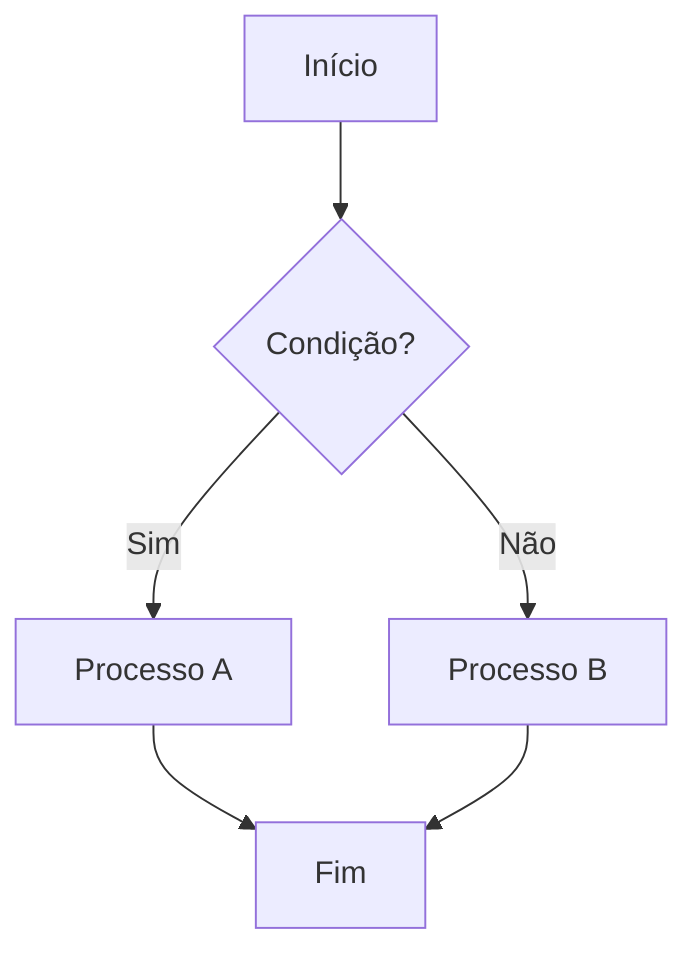

### Direções

```
TB  → de cima para baixo (padrão)
TD  → igual a TB
BT  → de baixo para cima
LR  → da esquerda para a direita
RL  → da direita para a esquerda
```

### Formas de nó

```
A[Retângulo]
B(Retângulo arredondado)
C([Estádio / pílula])
D[[Subrotina]]
E[(Banco de dados)]
F((Círculo))
G{Losango — decisão}
H{{Hexágono}}
I[/Paralelogramo/]
J[\Paralelogramo invertido\]
```

### Tipos de seta

```
A --> B        # Seta simples
A --- B        # Linha sem seta
A --texto--> B # Seta com rótulo
A -.-> B       # Seta pontilhada
A ==> B        # Seta grossa
A --o B        # Seta com círculo
A --x B        # Seta com X
```

### Subgrafos

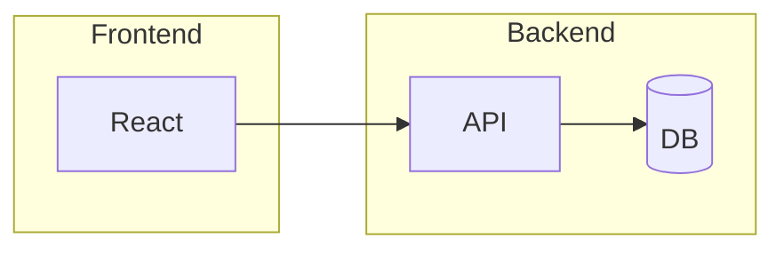

---

## 2. Diagrama de Sequência

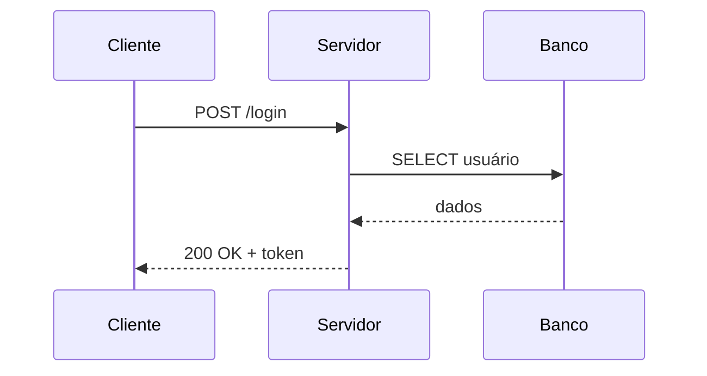

### Tipos de seta

```
->    # Linha sólida sem seta
-->   # Linha pontilhada sem seta
->>   # Linha sólida com seta
-->>  # Linha pontilhada com seta
-x    # Linha sólida com X (assíncrono)
--x   # Linha pontilhada com X
```

### Recursos

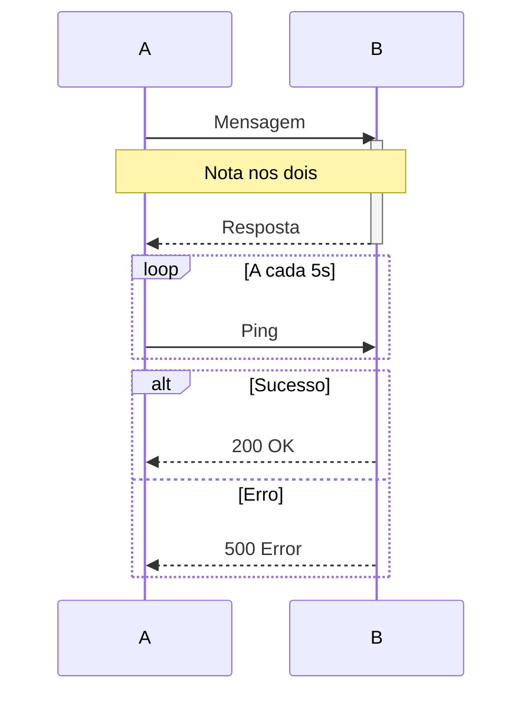

---

## 3. Diagrama de Classes (UML)

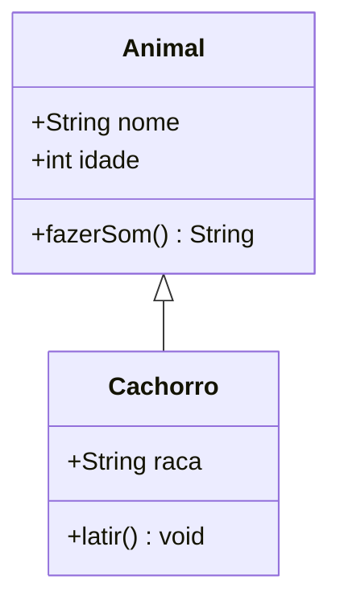

### Relacionamentos

```
A <|-- B      # Herança (B extends A)
A *-- B       # Composição
A o-- B       # Agregação
A --> B       # Associação
A -- B        # Linha simples
A ..> B       # Dependência
A ..|> B      # Realização / implementação de interface
```

### Modificadores de visibilidade

```
+   público
-   privado
#   protegido
~   pacote
```

---

## 4. Diagrama de Entidade-Relacionamento (ER)

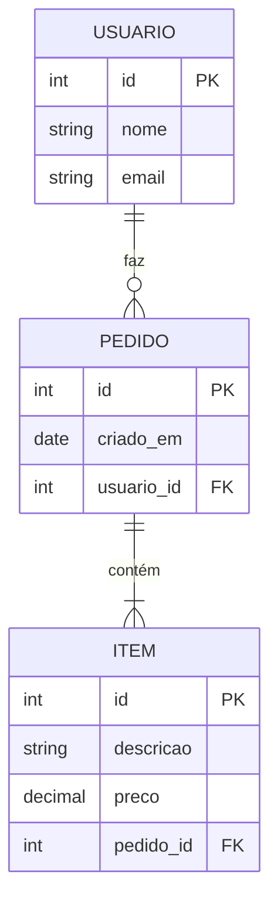

### Cardinalidades

```
|o    # Zero ou um
||    # Exatamente um
}o    # Zero ou muitos
}|    # Um ou muitos
```

---

## 5. Diagrama de Estado

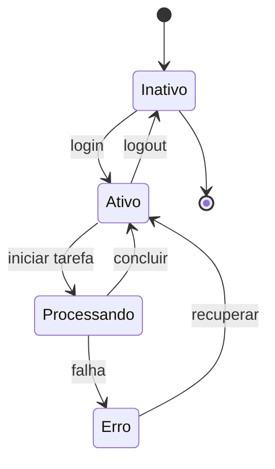

---

## 6. Gráfico de Gantt

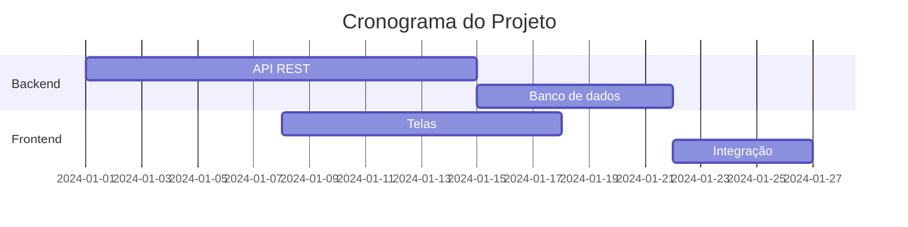

---

## 7. Gráfico de Pizza

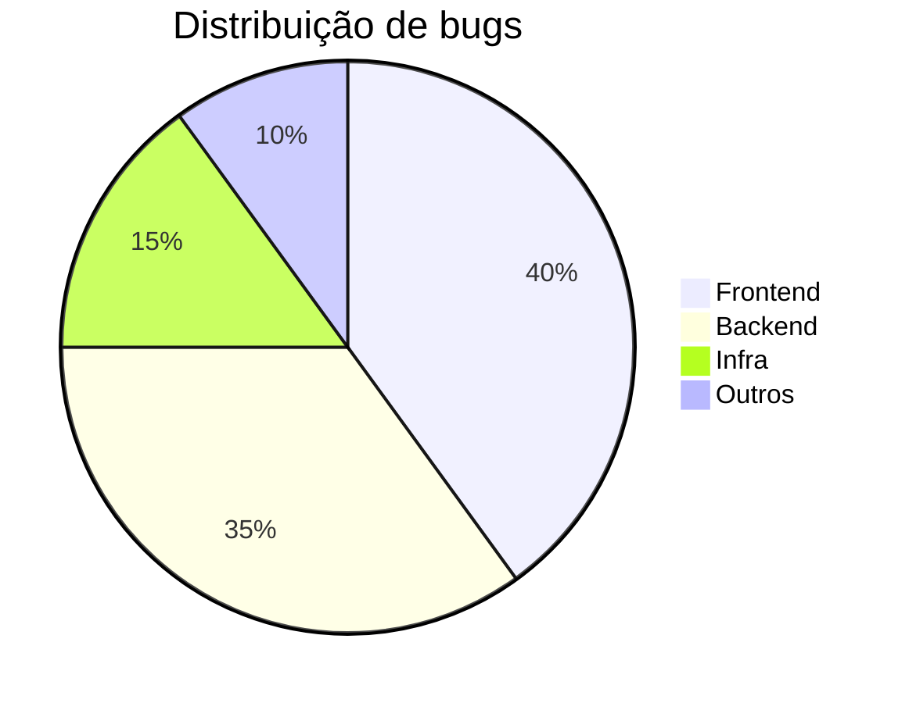

---

## 8. Diagrama de Jornada do Usuário

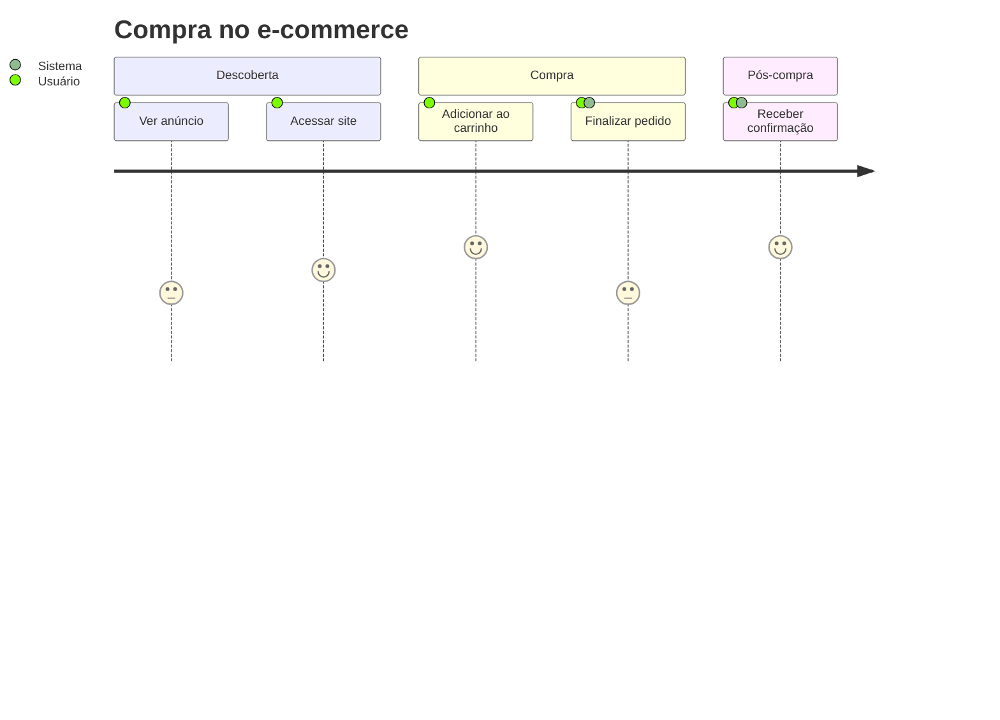

---

## 9. Mindmap

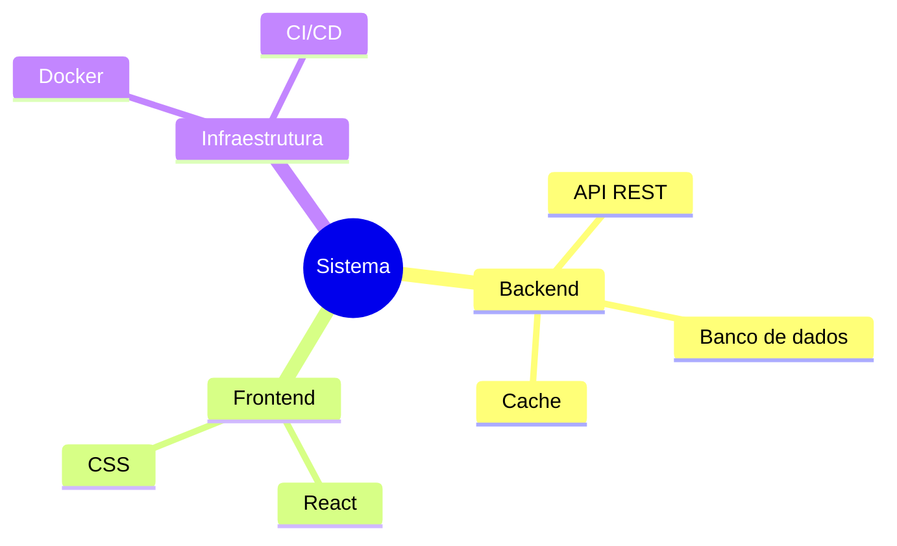

---

## 10. Timeline

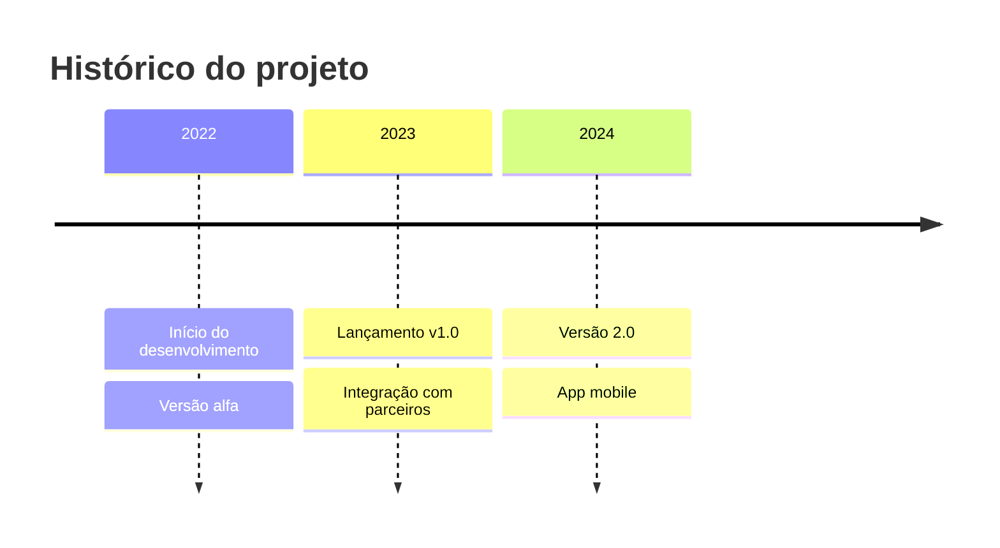

---

## 11. Estilos e temas

### Tema global

```
%%{init: {'theme': 'default'}}%%
```

Temas disponíveis: `default`, `dark`, `forest`, `neutral`, `base`

### Estilo de nó individual

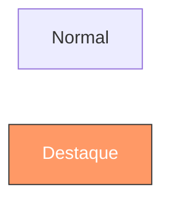

### Estilo inline

```
style A fill:#bbf,stroke:#33f
```

---

## 12. Dicas de uso

| Dica | Detalhe |
|---|---|
| GitHub | Suportado nativamente em `.md` com bloco ` ```mermaid ` |
| VS Code | Extensão **Mermaid Preview** para visualizar em tempo real |
| CLI | `npm install -g @mermaid-js/mermaid-cli` → `mmdc -i diagrama.mmd -o saida.svg` |
| Playground | [mermaid.live](https://mermaid.live) para testar online |
| Comentários | Use `%%` para comentários no diagrama |
